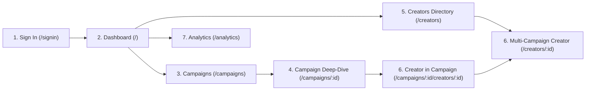

# HaulPack Brand Analytics — Simple Product Guide & PRD
**Written for Everyone:** Brand Managers, Founders, Marketers, Designers & Developers  
**Language:** Plain English (No heavy technical jargon)  
**Product:** Brand Reward Program Analytics Dashboard  

---

## 1. What is this Platform? (The Big Picture)

### In Simple Words:
When a brand (like **Myntra**) pays creators and influencers to post videos about their products, they need a clear way to see:
- *Are people actually watching the videos?*
- *Are people clicking the links to buy?*
- *How much total money (Sales in ₹) did these videos bring in?*
- *Which creators are the top performers?*

This dashboard is the **Brand's Command Center**. It collects all creator posts across Instagram and YouTube and turns them into clean, simple business numbers.

### The 3 Golden Numbers Every Brand Cares About:
1. **Views**: How many people saw the content.
2. **Clicks**: How many people tapped the link to shop.
3. **Sales Driven**: How much actual revenue (in ₹) was generated.

### What is Kept Out (On Purpose):
- **No Creator Payouts**: The brand does not see individual creator milestone payouts here. That is kept private.
- **No Order Logistics Counts**: Brands only care about total sales revenue (₹ GMV), so order volume numbers are removed to keep the screens clean.
- **No Campaign Creation Setup**: This tool is purely for **reading analytics and tracking performance**, not setting up rules.

---

## 2. Walkthrough of Every Page



---

### Page 1: Sign-In Screen (`/signin`)
* **What it is:** The entrance page for brand team members.
* **Why it exists:** Keeps brand data secure while making it effortless to log in.
* **What you see on the screen:**
  - The official **HaulPack Logo** at the top.
  - A simple **"1-Click Quick Demo Sign In"** button: One tap and you are inside the portal as a Myntra Brand Partner.
  - Standard **Work Email** and **Password** fields (with an eye icon to show/hide your password).
  - A clean "Sign In" button with a smooth loading indicator.

---

### Page 2: Executive Dashboard (`/`)
* **What it is:** The morning overview page that gives an instant health check of all campaigns.
* **What you see on the screen:**
  - **Welcome Banner:** Highlights the brand portal and gives quick buttons to jump to Campaigns or the Creator Directory.
  - **Campaign Counters:** Quick boxes showing how many campaigns are Active (2), Completed (1), or Scheduled (0).
  - **Aggregate Performance Bar:** A clean 4-item card showing totals across all campaigns:
    - **Total Content Created** (e.g., `450` videos/posts)
    - **Total Views** (e.g., `8Cr`)
    - **Total Clicks** (e.g., `29.4L`)
    - **Total Sales Driven** (e.g., `₹5.9Cr`)
  - **Recent Campaigns Table:** A list of recent programs (e.g., *Big Fashion Festival*, *End of Reason Sale*). Each row clearly shows its Views, Clicks, and Sales in green, plus a green "Active" badge.

---

### Page 3: Campaigns Directory (`/campaigns`)
* **What it is:** A complete list of all reward programs the brand has ever run.
* **What you see on the screen:**
  - Search bar to find any campaign by name or category (e.g., "Mega Sale", "Ethnic").
  - Filter dropdown to see only "Active" or "Completed" campaigns.
  - Table showing Campaign Name, Date Range, Active Creators Count, Content Count, Views, Clicks, Sales, and an "Explore" button to open that campaign's details.

---

### Page 4: Single Campaign Deep-Dive (`/campaigns/:id`)
* **What it is:** The detailed breakdown for one specific campaign (for example: *Myntra Big Fashion Festival 2026*).
* **What you see on the screen:**
  1. **Top 5 KPI Cards:**
     - **Total Creators:** How many creators joined this sale (e.g., `45`).
     - **Total Content:** Total reels and videos made (e.g., `240`).
     - **Total Views:** Total reach (e.g., `2.5Cr`).
     - **Total Clicks:** Shoppers who tapped into the catalog (e.g., `9.2L`).
     - **Total Sales:** Money made (e.g., `₹1.9Cr`).
  2. **Performance Trend Chart:** An interactive curve showing daily growth. You can switch between Views, Clicks, Sales, or Content, and choose 7 Days, 14 Days, 30 Days, or Campaign Duration.
  3. **Content Performance & Efficiency Box:** Explains how well each post performed on average:
     - **Avg Views per Post** (e.g., `1L`)
     - **Avg Clicks per Post** (e.g., `3.8K`)
     - **Avg Sales per Post** (e.g., `₹79.2K`)
     - **Click-Through Rate (CTR)** (e.g., `3.7%`)
     - **Avg Posts per Creator** (e.g., `5.3`)
     - **Platform Breakdown Chart:** Visual green/purple bars showing how much content was Instagram vs. YouTube.
  4. **Creator Leaderboard Table:** List of every creator in this campaign.
     - **Platform Badge:** A pink Instagram or red YouTube badge with an arrow `↗`. **Clicking it opens their real profile in a new tab!**
     - Clicking anywhere else on the row opens their campaign performance details.

---

### Page 5: All Creators Directory (`/creators`)
* **What it is:** A master phonebook/roster of all influencer partners.
* **What you see on the screen:**
  - Summary cards at the top: Total Influencers (`50` unique, `140` total participations), Total Content, and Total Sales.
  - Search box to find creators by name or handle (e.g. `@aditisharma`).
  - Table showing their avatar, name, social handle, platform (with direct link `↗`), followers count, how many campaigns they joined, views, clicks, and sales generated.
  - Clicking a creator takes you to their **Multi-Campaign Profile**.

---

### Page 6: Multi-Campaign Creator Profile (`/creators/:id`)
* **What it is:** The ultimate creator scorecard across **ALL 3 Myntra campaigns**.
* **Why it is special:** Usually, brands only see what a creator did in one sale. Here, brands can see if a creator consistently delivers across *Big Fashion Festival*, *End of Reason Sale*, and *Festive Glam*.
* **What you see on the screen:**
  - Header with their name, clickable handle, followers, and a badge: *"Participated in 3 / 3 Campaigns"*.
  - Cumulative totals across all campaigns.
  - **Campaign Breakdown Cards:** Side-by-side cards comparing their performance in Campaign 1 vs Campaign 2 vs Campaign 3.
  - **Top Performing Content Showcase:** Cards showing their most viral reels and videos with a "View Content" button that opens the actual Instagram/YouTube post.

---

### Page 7: Campaign-Specific Creator Drilldown (`/campaigns/:id/creators/:id`)
* **What it is:** When a brand wants to see what a creator did inside *just one* campaign.
* **What you see on the screen:**
  - A helpful banner at the top: *"Campaign-specific analytics for [Campaign Name]"* with a button to *"View All Campaigns & Multi-Program Analytics →"*.
  - 4 clean KPIs: Total Content, Views, Clicks, Sales.
  - A day-by-day chart of their posts during the sale.
  - Two summary cards:
    - **Sales Analytics:** Total Sales, Approved Sales (92%), and Avg Sales per Post.
    - **Traffic Analytics:** Total Views, Clicks, and CTR %.
  - Complete list of their videos published for this specific campaign with direct "View" buttons.

---

### Page 8: Cross-Program Analytics (`/analytics`)
* **What it is:** The macro-level executive analytics suite.
* **What you see on the screen:**
  - **Time Filter:** Buttons to view `All Time`, `Last 30 Days`, `Last 14 Days`, or `Last 7 Days`.
  - **5 Top KPIs:** Active Creators, Content, Views, Clicks, Sales.
  - **Interactive Campaign Benchmark Bar Chart:** You can click tabs for **Views**, **Clicks**, **Sales Driven**, or **Content Count**. The chart switches instantly to compare all 3 Myntra campaigns with clean colored bars.
  - **Content Unit Economics Card:** 4 clear boxes explaining the average return per post and revenue generated per click.
  - **Platform Channel Deep-Dive:** A modern Donut chart showing total views, plus side-by-side cards comparing **Instagram** (photos/reels) vs. **YouTube** (videos/shorts) with their CTR and sales.
  - **Cross-Campaign Audit Table:** A complete matrix comparing every campaign side-by-side with an "Explore" button for each.

---

## 3. Every Component Explained

| Component Name | What it Looks Like | What it Does / Where it is Used |
| :--- | :--- | :--- |
| **HaulPack Logo** | Shopping bag emblem with "HaulPack" text | Positioned at the top of the sidebar and on the sign-in page. Clicking it always takes you back to the Dashboard. |
| **Sidebar Menu** | Left vertical navigation bar | Clean links to Dashboard, Campaigns, Creators, and Analytics with purple highlight on the active page. |
| **User Badge & Sign Out** | Bottom of the sidebar | Shows who is logged in (`Myntra Brand Operations`) and a clean button to Sign Out back to `/signin`. |
| **Floating Shopping Bag** | Dark purple circular floating button in bottom right | Authentic HaulPack action widget for quick brand shortcuts. |
| **KPICard** | White rounded box with a large bold number | Displays primary stats (Views, Clicks, Sales) with an accent-colored icon on the left. |
| **StatusBadge** | Green or gray rounded pill | Indicates whether a campaign is **Active** (green) or **Completed** (gray). |
| **Platform Badge Link** | Pink Instagram badge or Red YouTube badge with `↗` | **Clickable hyperlink!** Clicking opens the creator's real Instagram or YouTube profile in a new tab without clicking into the row. |
| **Performance Curve Chart** | Smooth colored line/area chart | Shows daily trend trajectory (upward spikes on sale days). Built with Recharts. |
| **Comparison Bar Chart** | Vertical bars with switcher tabs | Allows brand to compare campaigns by Views, Clicks, Sales, or Content at the click of a button. |
| **Content Detail Drawer** | Slide-out panel from the right side of the screen | Opens when clicking a content row to show full thumbnail, title, caption, and a 2×2 performance grid (Views, Clicks, Sales, Conversion). |
| **Export Button** | Button with download tray icon | Lets the brand download a clean report in CSV or PDF format. |
| **Search Bar** | Text input with magnifying glass | Lets you instantly filter creators or campaigns by typing any keyword. |

---

## 4. How Calculations Work (Simple Math)

All numbers are calculated from individual creator posts:

1. **Total Views** = Add up views from all videos.
2. **Total Clicks** = Add up link clicks from all videos.
3. **Total Sales** = Add up all revenue generated in ₹ from all videos.
4. **Click-Through Rate (CTR)** = $(\text{Clicks} \div \text{Views}) \times 100$  
   *Example: If 1,000 people watch and 37 click, CTR is 3.7%.*
5. **Avg Sales per Post** = $\text{Total Sales} \div \text{Total Posts}$  
   *Example: ₹1.9Cr sales across 240 posts = ₹79,200 average sales per post.*
6. **Revenue per Click** = $\text{Total Sales} \div \text{Total Clicks}$  
   *Example: ₹5.9Cr sales from 29.4L clicks = ₹20.10 earned per shopper click.*

---

## 5. Typical Day in the Life: How a Brand Uses This

```
1. 09:00 AM — Quick Check
   Brand Manager opens dashboard. Looks at Aggregate Performance Bar.
   Sees: 8Cr Views, 29.4L Clicks, ₹5.9Cr Sales. Everything is running smoothly.

2. 10:30 AM — Campaign Audit
   Opens "Myntra Big Fashion Festival".
   Checks Content Efficiency box to see that CTR is 3.7% and Avg Sales/Post is ₹79.2K.

3. 02:00 PM — Creator Discovery & Verification
   Sorts creator table by "Sales" to find top sellers.
   Clicks the pink "Instagram ↗" badge on Aditi Sharma's row.
   Aditi's actual Instagram profile opens in a new tab to review her aesthetic.

4. 04:00 PM — Multi-Campaign Evaluation
   Clicks Aditi Sharma's name to view her Multi-Campaign Profile.
   Confirms she participated in all 3 Myntra sales and generated over ₹35 Lakhs total.
   Decides to invite her to the upcoming Diwali campaign.
```

---

## 6. Summary

This dashboard strips away confusing operational clutter and gives brands exactly what they need:
- **Instant visibility** into reach, clicks, and money made.
- **Direct access** to creator content and social profiles.
- **Deep intelligence** across multiple campaigns over time.
- **A fast, clean, premium user experience** that is simple for anyone to understand.
